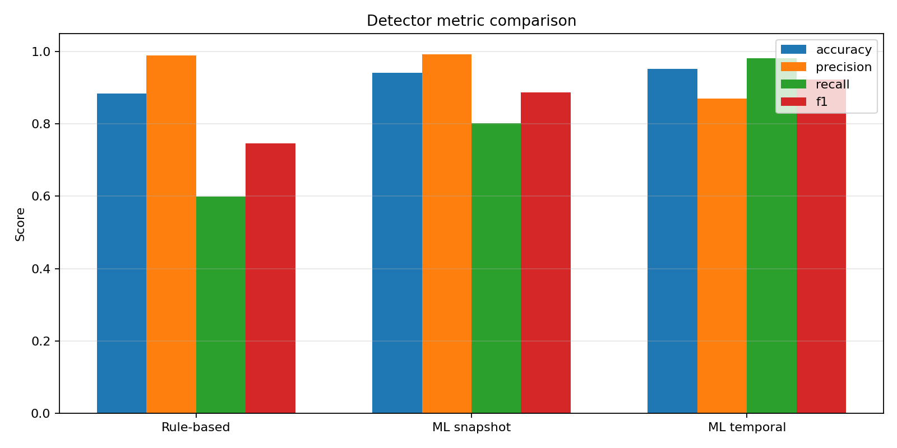
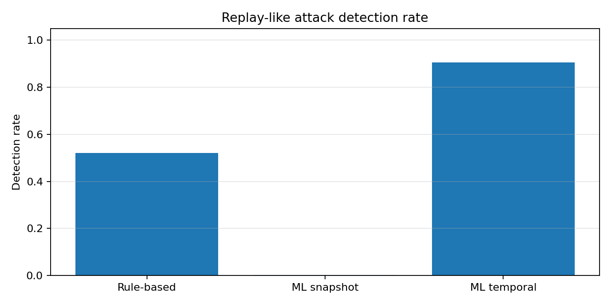

# Secure IoT Sensor Anomaly Detection

Defensive anomaly detection for IoT sensor telemetry using real environmental sensor data and simulated spoofing / false-data injection scenarios.

This project studies a practical security question:

    Can suspicious IoT sensor behavior be detected from telemetry data before it affects monitoring or automation decisions?

The project is not about attacking real devices or networks. It focuses on defensive monitoring for IoT and cyber-physical systems.

## Why This Project Exists

IoT systems often depend on sensor streams to describe the physical world. If a sensor value is spoofed, replayed, frozen, or manipulated, the software layer may make wrong decisions.

In this repository, I use real IoT telemetry data, inject controlled anomaly scenarios, and compare different detection approaches:

- rule-based anomaly detection
- machine-learning detection using current sensor values
- machine-learning detection using current values plus temporal behavior

## Dataset

The project uses the Kaggle Environmental Sensor Telemetry Data dataset.

The raw dataset contains sensor streams with fields such as:

- timestamp
- device identifier
- carbon monoxide
- humidity
- light state
- LPG
- motion state
- smoke
- temperature

The raw dataset is not committed to this repository. Place it locally at:

    data/raw/iot_telemetry_data.csv

## Implemented Pipeline

After placing the raw dataset at `data/raw/iot_telemetry_data.csv`, run:

    python src/inspect_dataset.py
    python src/prepare_dataset.py
    python src/inject_spoofing_attacks.py

Then run the detectors:

    python src/rule_based_detector.py
    python src/ml_detector.py
    python src/ml_temporal_detector.py

The preprocessing script creates a cleaned telemetry dataset. The spoofing script creates a labeled local dataset with normal samples and simulated attack samples.

Generated CSV files inside `data/processed/` and prediction CSV files inside `results/` are ignored by Git.

## Simulated Attack Types

The labeled dataset includes normal samples and five simulated anomaly / spoofing scenarios:

- light-motion mismatch
- temperature spoofing
- gas sensor spoofing
- replay-like values
- mixed false-data injection

The attack scenarios are controlled and synthetic. They are useful for testing detection methods, but they are not a replacement for evaluation on real attack traces.

## Results

Three detectors are currently implemented.

### Rule-Based Detector

The rule-based detector uses simple explainable checks based on sensor ranges, gas sensor spikes, and light-motion mismatch.

Result:

    Accuracy:  0.8838
    Precision: 0.9893
    Recall:    0.5998
    F1-score:  0.7468

This detector produces very few false alarms, but it misses some attack types. It is strong for gas spoofing and mixed false-data injection, but weak for subtle single-sensor temperature spoofing.

### Machine-Learning Detector

The first machine-learning detector uses only the current sensor values:

- co_level
- humidity
- light
- lpg_level
- motion
- smoke_level
- temperature_c

Model:

    RandomForestClassifier

Result:

    Accuracy:  0.9419
    Precision: 0.9930
    Recall:    0.8023
    F1-score:  0.8875

This model improves the overall result compared with the rule-based detector. However, it almost completely misses replay-like attacks, because replayed values may still look normal when each row is inspected independently.

Replay-like detection rate:

    replay_like_values: 0.0017

### Temporal Machine-Learning Detector

The temporal detector adds behavior-based features such as sensor deltas, total sensor change, repeated signatures, and same-value indicators.

Model:

    RandomForestClassifier with snapshot and temporal features

Result:

    Accuracy:  0.9528
    Precision: 0.8700
    Recall:    0.9813
    F1-score:  0.9223

Replay-like detection improves strongly after adding temporal features:

    replay_like_values: 0.9057

This shows that replay-like anomalies are difficult to detect from single sensor snapshots, but become more visible when sensor behavior over time is considered.

### Time-Based Temporal Evaluation

I also tested the temporal detector with a device-wise time-based split: the first 70% of each device timeline is used for training, and the last 30% is used for testing.

This is a harder check than the random split because the model is evaluated on later samples from each device timeline.

Result:

    Accuracy:  0.9515
    Precision: 0.8662
    Recall:    0.9785
    F1-score:  0.9190

Replay-like detection on the time-based test set stayed close to the random-split result:

    replay_like_values: 0.8965

This makes the replay-detection result more defensible. It still depends on simulated attack labels, but it is not only a random train/test split result.

### Device-Held-Out Temporal Evaluation

I also tested a stricter setting where the model trains on two devices and tests on the third held-out device. This checks whether the temporal detector generalizes to an unseen device, not just later samples from devices already seen during training.

Average result across the three held-out devices:

    Accuracy:  0.8319
    Precision: 0.6462
    Recall:    0.9132
    F1-score:  0.7568

This is noticeably weaker than the random and time-based splits. Replay-like detection also drops on unseen devices:

    replay_like_values: about 0.42 to 0.70 depending on the held-out device

This is an important limitation. The temporal features help detect replay-like behavior, but device-specific behavior still matters. The next hard improvement should focus on device generalization, calibration differences, or more device-diverse training data.

## Visual Results

### Detector Metric Comparison

### Replay-Like Attack Detection Comparison

Additional confusion-matrix plots are available in the `results/` directory:

- `results/rulebased_confusion_matrix.png`
- `results/ml_snapshot_confusion_matrix.png`
- `results/ml_temporal_confusion_matrix.png`

## Repository Structure

    secure-iot-sensor-anomaly-detection/
    ├── data/
    │   ├── raw/
    │   └── processed/
    ├── docs/
    ├── results/
    │   ├── rule_based_metrics.txt
    │   ├── ml_detector_metrics.txt
    │   ├── ml_temporal_metrics.txt
    │   ├── ml_temporal_time_split_metrics.txt
    │   └── ml_temporal_device_holdout_metrics.txt
    ├── src/
    │   ├── inspect_dataset.py
    │   ├── prepare_dataset.py
    │   ├── inject_spoofing_attacks.py
    │   ├── rule_based_detector.py
    │   ├── ml_detector.py
    │   ├── ml_temporal_detector.py
    │   ├── ml_temporal_time_split_eval.py
    │   └── ml_temporal_device_holdout_eval.py
    ├── .gitignore
    ├── requirements.txt
    └── README.md

## Main Takeaways

The rule-based detector is precise but misses some attacks.

The snapshot ML detector gives better overall performance, but fails on replay-like values.

The temporal ML detector performs best overall because it uses changes over time, not only current sensor values. A device-wise time-based split gives a similar result, but a device-held-out evaluation is harder and shows weaker generalization.

This is an important result for IoT security: some attacks are not obvious from individual sensor readings. They require temporal context.

## Limitations

The attack labels are generated from simulated spoofing scenarios, not from real compromised IoT devices.

The original ML comparison uses a random train/test split. Time-based and device-held-out evaluations have now been added for the temporal detector. The device-held-out result is weaker, so future work should focus on improving cross-device generalization.

The replay detection result depends on how replay-like values were simulated.

The models are evaluated offline. They are not yet deployed in a live MQTT or edge-monitoring pipeline.

## Defensive Scope

This repository is focused on defensive anomaly detection and secure monitoring. It does not provide instructions for attacking real systems, bypassing networks, or exploiting devices.

## Next Steps

Possible next improvements:

- add plots for anomaly timelines and confusion matrices
- improve device-held-out generalization
- test device-based generalization
- add a lightweight real-time monitor
- connect the detector to an IoT / MQTT pipeline
